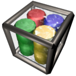
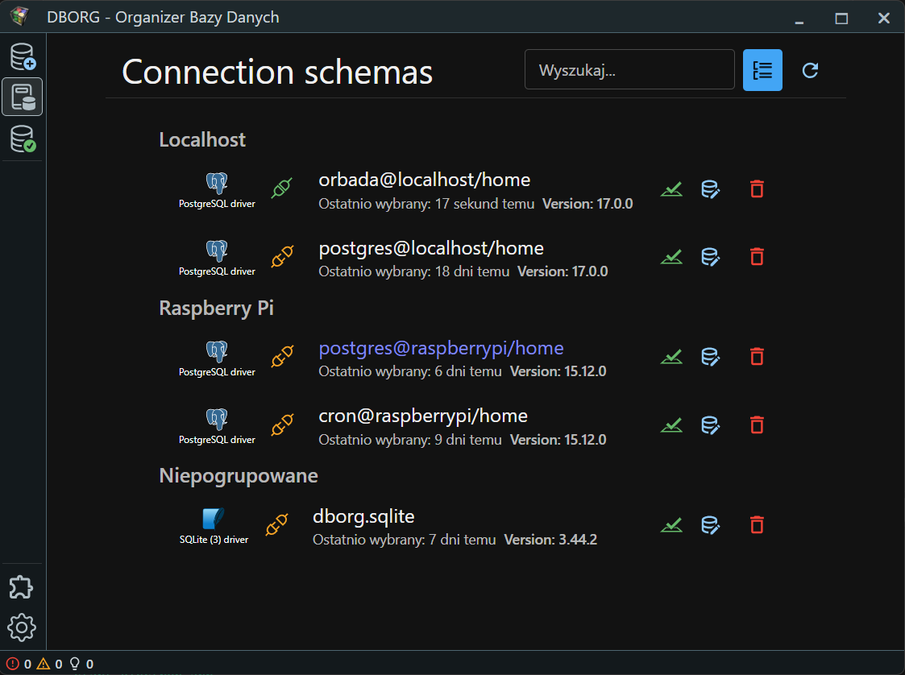
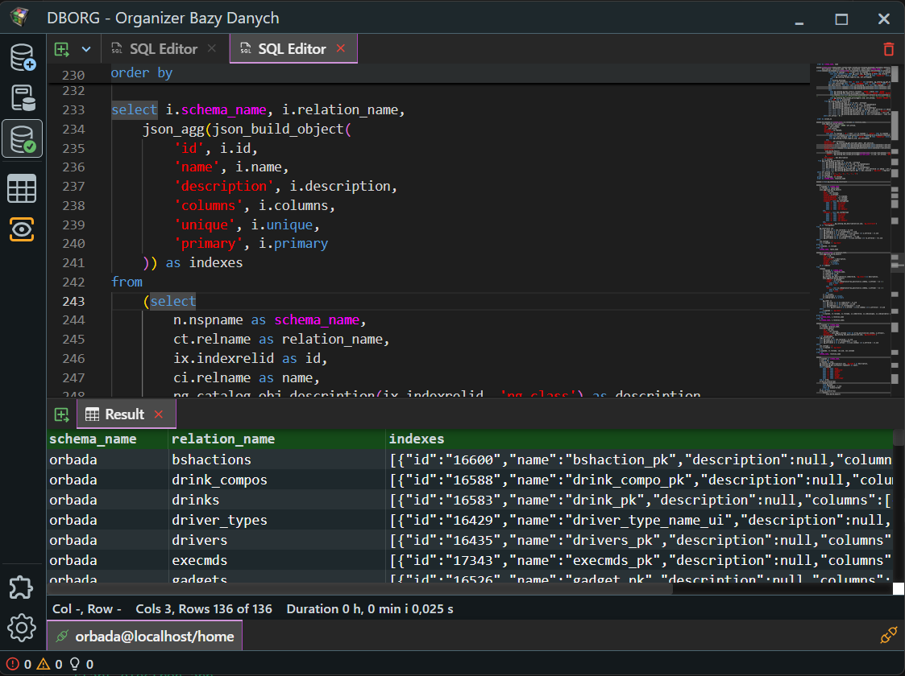
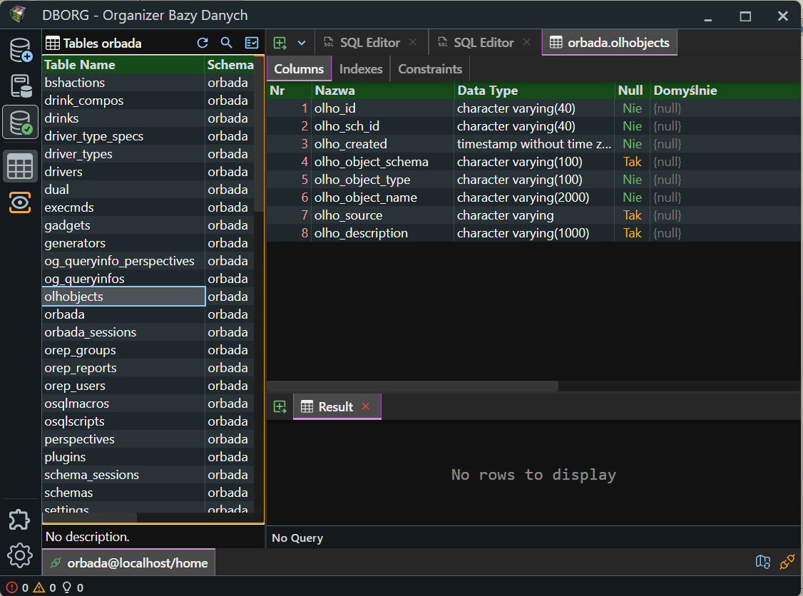

#  orbada (ipa: ɔːrbˈɑːdə)

> **Note:** This application is under development and is not intended for production use. It may contain bugs and incomplete features.

**orbada** is an application designed for analyzing, processing, and visualizing SQL queries, as well as managing database structures. The project is tailored for professionals working with relational databases, including administrators, developers, and anyone seeking to better understand SQL syntax and operations.

### Built for Large-Scale Systems

This program is specifically designed with large-scale systems in mind. Large-scale, in this context, refers to environments with tens of thousands of tables, functions, and views, where datasets consist of billions of records. To optimize performance, many features operate on locally fetched data, minimizing the need for frequent database queries.

You won't find flashy wizards, magical shortcuts, or the ability to edit everything a developer might imagine. Instead, **orbada** provides robust support for building SQL queries that allow users to modify data and construct database structures, executing them at the right moment under full user control.

### Technologies Used

The application is built with the following technologies:
- **TypeScript** (main application language)
- **Node.js** (runtime environment)
- **Electron** (desktop interface)
- **React** (reactive user interface)
- **MaterialUI** (user interface)

## Screenshots

Below are sample screenshots of the application:

